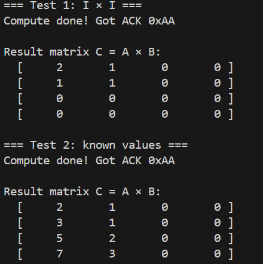
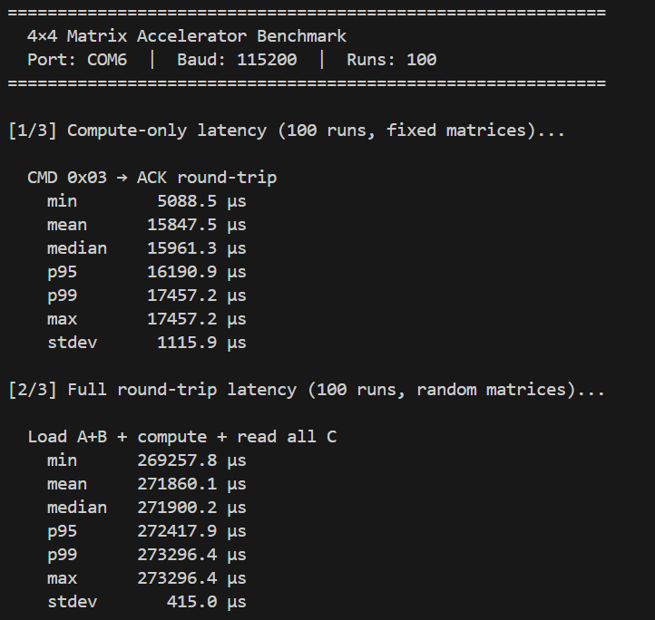
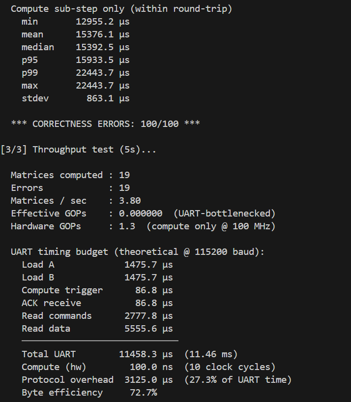
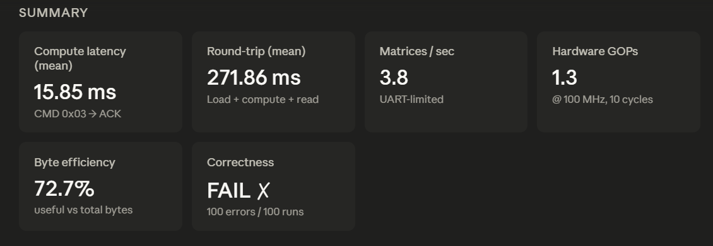
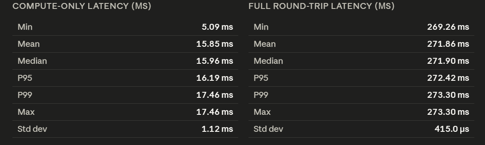
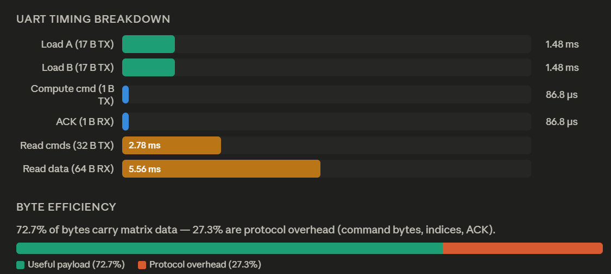

# 4×4 Matrix Multiplication Accelerator
**Target:** Digilent Arty A7-100T | **Clock:** 100 MHz | **UART:** 115200 8N1

## File Overview

| File | Purpose |
|---|---|
| `baud_gen.v` | 16× oversampled baud tick generator (÷54 counter) |
| `uart_rx.v` | 8N1 UART receiver, 16× oversampled, double-flop sync |
| `uart_tx.v` | 8N1 UART transmitter |
| `pe.v` | Single processing element: `acc += a * b` (8-bit × 8-bit → 32-bit) |
| `systolic_array_4x4.v` | 16 PEs wired in a weight-stationary 4×4 grid |
| `matrix_bram.v` | Synchronous RAM for matrices A, B, C |
| `controller.v` | UART command FSM + systolic scheduling |
| `top_matrix_uart.v` | Top-level, connects all modules, drives LEDs |
| `top_matrix_uart.xdc` | Xilinx pin constraints for Arty A7-100T |

---

## UART Command Protocol

All bytes are sent/received at 115200 8N1. Multi-byte values are **little-endian**.

### CMD 0x01 — Write Matrix A
```
TX: 0x01  [16 bytes: A[0][0] .. A[3][3] row-major, signed 8-bit]
RX: (none)
```

### CMD 0x02 — Write Matrix B
```
TX: 0x02  [16 bytes: B[0][0] .. B[3][3] row-major, signed 8-bit]
RX: (none)
```

### CMD 0x03 — Compute C = A × B
```
TX: 0x03
RX: 0xAA  (acknowledgement when computation is complete)
```

### CMD 0x04 — Read one element of C
```
TX: 0x04  [1 byte: element index 0–15, row-major]
RX: [4 bytes: C[idx] as signed 32-bit little-endian]
```

### Error response
Any unrecognised command byte → `0xFF` (NAK).

---

## LED Indicators

| LED | Signal | Description |
|---|---|---|
| LED0 | `busy` | High while receiving data or computing |
| LED1 | `done` | High after computation completes |
| LED[7:2] | `C[0][0][5:0]` | 6-bit live preview of top-left result |

---

## Systolic Array Architecture

**Weight-stationary, skewed-feed** variant:

```
         B[0][0] B[0][1] B[0][2] B[0][3]   ← col inputs (top edge)
            ↓       ↓       ↓       ↓
A[0][0] → PE(0,0)→PE(0,1)→PE(0,2)→PE(0,3)
A[1][0] → PE(1,0)→PE(1,1)→PE(1,2)→PE(1,3)
A[2][0] → PE(2,0)→PE(2,1)→PE(2,2)→PE(2,3)
A[3][0] → PE(3,0)→PE(3,1)→PE(3,2)→PE(3,3)
```

Each PE performs `acc += a_in × b_in` and passes `a_in` right and `b_in` downward.

**Skew schedule:** `A[i][k]` enters row `i` at time `t = k + i`; `B[k][j]` enters
column `j` at time `t = k + j`. The controller feeds zeros outside each window.
Total compute window = **10 clock cycles**.

---

## Timing Budget

| Path | Estimate |
|---|---|
| Clock period | 10 ns |
| PE multiply (8×8) | ~2 ns (DSP48) |
| PE add (32-bit) | ~3 ns |
| BRAM read latency | 1 clock cycle |
| UART byte time @ 115200 | ~87 µs |
| Time to load A+B (32 bytes) | ~2.8 ms |
| Compute time | 10 cycles = 100 ns |
| Time to read all 16 results | ~5.6 ms |

---

## Quick-Start (Vivado)

1. Create a new Vivado project targeting `xc7a100tcsg324-1`.
2. Add all `.v` files as design sources.
3. Add `top_matrix_uart.xdc` as a constraint file.
4. Set `top_matrix_uart` as the top module.
5. Run Synthesis → Implementation → Generate Bitstream.
6. Program the board and open a serial terminal at 115200 8N1.

---

## Design Notes & Extension Points

- **Single BRAM port:** The current `controller.v` uses one shared read port for
  A and B during systolic feeding. For a complete parallel skew implementation,
  add separate register files (`reg [7:0] reg_a[0:15]`) that hold the matrices
  in flip-flops, allowing all 4 row/column values to be read simultaneously.

- **Accumulator overflow:** With 8-bit signed inputs and 4 accumulations, the
  maximum magnitude is 127×127×4 = 64,516, which fits in 17 bits. The 32-bit
  accumulator has substantial headroom.

- **Pipelining:** The PE already has registered outputs for `a_out` and `b_out`,
  giving a fully pipelined wavefront. The systolic data wave propagates correctly
  as long as the controller applies the correct skew.

- **Result readback:** After `0xAA` is received, issue `0x04 <idx>` for each of
  the 16 elements. A simple Python script can automate this.

Results:



Benchmark:











